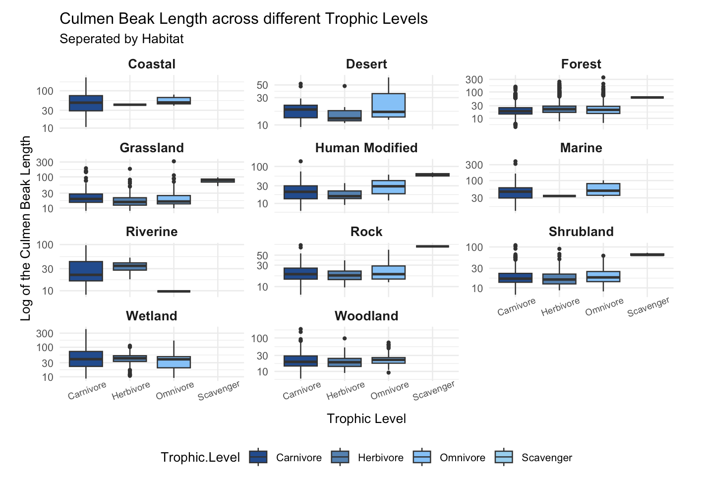

```{r install-package, include = FALSE, eval = FALSE}
# Copy and paste the following code into your console to download and install
# the `xaringan` package that contains all of the code which allows you 
# to create presentation slides in Rmarkdown
install.packages('xaringan')
install.packages("xaringanthemer")
install.packages("kableExtra")
```


```{r load-packages, include = FALSE}
# Add any additional packages you need to this chunk
library(tidyverse)
library(tidymodels)
library(palmerpenguins)
library(knitr)
library(xaringanthemer)
library(readxl)
library(kableExtra)
```

```{r setup, include=FALSE}
# For better figure resolution
knitr::opts_chunk$set(fig.retina = 3, dpi = 300, fig.width = 6, fig.asp = 0.618, out.width = "80%")
```

```{r xaringan-tachyons, echo=FALSE}
xaringanExtra::use_tachyons()
```

```{r xaringanExtra, echo = FALSE}
xaringanExtra::use_progress_bar(color = "#548B54", location = "top")
```

```{r xaringan-themer, include=FALSE, warning=FALSE}
library(xaringanthemer)
style_mono_accent(
  base_color = "#556B2F",
  header_font_google = google_font("Josefin Sans"),
  text_font_google   = google_font("Montserrat", "300", "300"),
  code_font_google   = google_font("Fira Mono")
)

```


```{r load-data, include=FALSE}
# Load your data here
AVONET3_BirdTree <- read_excel("data/AVONET3_BirdTree.xlsx", 
    sheet = "AVONET3_BirdTree")
```


# Introduction

We chose to investigate the AVONET Bird dataset. This dataset includes many traits of various species of birds, such as ecological variables, morphological traits and information on geographical conditions of the birds.

The dataset contains 9,993 observations with 36 columns, with each observation corresponding to a recorded bird species. However we will only be utilising 6 variables for our investigation.

We tidied the data to only include these variables then perfomed analysis, in order to answer the following research question:

--

.bg-washed-green.b--dark-green.ba.bw2.br3.shadow-5.ph4.mt5[
What is the relationship between beak length, mass, and trophic level amongst different habitats?

.tr[

]]

---
# The variables being used:
.pull-left[
- Species, Total Individuals, Habitat, Trophic Level, Culmen Length and Mass

Our assumptions for these variables are:
- Each species is correctly assigned to a habitat

- Data is representative of entire population

- Age related variation was minimal

- Each species falls into one of the four categories for trophic level
]
--
.pull-right[
- Culmen length of a bird:

```{r culmen, out.width = "100%", fig.width = 4, echo = FALSE}
include_graphics("img/bird_culmen.png")
```
<br> by Beatrice
]
---

# Total individuals within each habitat
.pull-left[
```{r, out.width= "80%", fig.width= 8, echo=FALSE}
Bird_data <- AVONET3_BirdTree %>%
  select(Species3, Total.individuals, Beak.Length_Culmen, Habitat, Trophic.Level, Trophic.Niche, Mass) %>%
  filter(Total.individuals > 5)
 

Total_Habitat <- Bird_data %>%
  group_by(Habitat) %>%
  summarise(total.birds = sum(Total.individuals)) %>%
  filter(Habitat != "NA")


ggplot(data  = Total_Habitat, 
       aes(x = Habitat,
           y = total.birds,
           fill = Habitat)) +
         geom_col() +
  theme_minimal() +
    theme(axis.text.x = element_text(angle = 45, hjust = 1, size = 10)) +
      scale_fill_brewer(type = "div",
                        palette = 9,
                        direction = 1,
                        aesthetics = "fill") +
  labs(title = "Total bird count within each habitat",
       x = "Habitat",
       y = "Total Birds")

```

- Shows a strong imbalance in bird count across habitat, with forest having over 40,000 individuals

- Shrubland and woodland have moderate counts, but the rest have fewer than 4,000 individuals

]

--
.pull-right[
```{r, echo=FALSE}
total_trophic <- AVONET3_BirdTree %>%
  group_by(Trophic.Level) %>%
  summarise(total.birds = sum(Total.individuals)) %>%
  filter(Trophic.Level != "NA")

pink <- c("#FFC4D6", "#FFA6C1", "#FF87AB", "#FF5D8F")

ggplot(data = total_trophic,
       aes(x = Trophic.Level,
           y = total.birds,
           fill = Trophic.Level)) +
  geom_col() +
  theme_minimal() +
  scale_fill_manual(values = pink) +
  labs(title = "Total bird count within each Trophic Level",
       x = "Trophic Level",
       y = "Total Birds")
```
- Shows a strong imbalance in bird count across trophic level, with carnivores having nearly 50,000 individuals.

- This is significantly higher than bird count in other trophic levels
]

---
#Faceted Boxplots

.pull-left[
```{r, out.width= "100%", echo=FALSE}

```
]
--
.pull-right[
- Implemented a log-scaled y-axis to improve readability

- There are patterns between the different ecological niches; aquatic, tree-dominated and open terrestrial
]
---

# Histogram showing frequency of culmen length

.pull-left[
```{r, echo=FALSE}
histogram <- ggplot(Bird_data, 
       aes(
         x = Beak.Length_Culmen, 
         weight = Total.individuals)) +
  geom_histogram(binwidth = 0.2, fill = "steelblue") +
  labs(title = "Histogram of Beak Lengths (Weighted by Individuals)",
       x = "Beak Length (Culmen)", 
       y = "Total Individuals") +
  scale_x_continuous(limits = c(0, 100)) +
  theme_minimal() +
  geom_vline(xintercept = c(8, 25), 
             linetype = "dashed", 
             color = "red") 

suppressWarnings(print(histogram))
```
]

--

.pull-right[
- Three quarters of the birds have culmen lengths between the values of 8 and 25, with the peak occurring around 15mm

- There were few values above 100 mm, but we changed the scale of the visualisation in order to increase readability

- The histogram is positively skewed, so the mean is higher than the median

]

---

# Scatterplot of mass and culmen length

.pull-left[
```{r, out.width= "100%", fig.width= 6, echo=FALSE}
birds.data_mass <- Bird_data %>%
  select(Species3, Total.individuals, Beak.Length_Culmen, Habitat, Mass, Trophic.Level)%>%
  mutate(Mass_kg = Mass/1000,
         log_mass_kg = log(Mass_kg), log_culmen = log(Beak.Length_Culmen)) %>%
  filter(Trophic.Level != "NA")

ggplot(data = birds.data_mass,
       mapping = aes(x = log_culmen,
                     y = log_mass_kg)) +
  geom_point(alpha = 0.6, size = 0.6, mapping = aes(colour = Trophic.Level)) +
  geom_smooth(method = lm, se = FALSE, formula = y ~ x) +
  labs(
    title = "Bird Culmen Length vs. Mass",
    subtitle = "by trophic level",
    x = "Log of Culmen Length (mm)", 
    y = "Log of Mass (kg)",
    colour = "Trophic Level"
  ) +
  scale_colour_manual(values = c(
    "Carnivore" = "#88419d",
    "Herbivore" = "#d7b5d8",
    "Omnivore" = "#41b6c4",
    "Scavenger" = "#0570b0"
  )) +
  theme_minimal() +
  theme(legend.title = element_text(size = 12))
```

- The scatterplot shows a positive correlation between the log of the variables
]


--
```{r, echo=FALSE}
linear_reg() %>%
  set_engine("lm") %>%
  fit(log_mass_kg ~ log_culmen, data = birds.data_mass) %>%
  tidy()
```
.pull-right[

- The linear regression gives the equation log(Mass_kg) = -9.585 + 2.085*log(Culmen Length)

- So for every 1% increase in culmen length, the mass increases by 2.085%, birds with longer culmen lengths are able to consume a larger food sources, and so it makes sense that they will have a larger mass

- Birds in the carnivore trophic level has the largest spread between data points, due to the fact it is the largest trophic level and so will contain the most variety.

]

---
#Model Analysis

```{r, echo=FALSE, warning=FALSE}
size_data <- mutate(Bird_data,
                    size =
                    factor(case_when(
                      Beak.Length_Culmen < 20.0 ~ "small",
                      Beak.Length_Culmen >= 20.0 ~ "big"
                      )))

set.seed(123)

bird_split <- initial_split(size_data, prop = 0.80)

train_data <- training(bird_split)
test_data  <- testing(bird_split)

bird_rec <- recipe(
  size ~ Habitat + Trophic.Level + Mass,       
  data = train_data 
  ) %>%
  step_dummy(all_nominal(), -all_outcomes())

bird_mod <- logistic_reg() %>%
  set_engine("glm")

bird_wkflow <- workflow() %>% 
  add_model(bird_mod) %>% 
  add_recipe(bird_rec)

bird_fit <- bird_wkflow %>%
  fit(data = train_data)

bird_pred <- predict(bird_fit, test_data, type = "prob") %>% 
  bind_cols(test_data)

cutoff_prob <- 0.5
bird_table <- bird_pred %>%
  mutate(
    size      = if_else(size == "small", "Bird beak is small", "Bird beak is big"),
    size_pred = if_else(.pred_small > cutoff_prob, "Bird beak labelled as small", "Bird beak labelled as big")
    ) %>%
  count(size_pred, size) %>%
  pivot_wider(names_from = size, values_from = n)
```


.pull-left[
```{r, fig.width = 4, echo=FALSE}


bird_table %>%
  kbl() %>%
  kable_styling(font_size = 18)

```
- Predicts the beak length of a bird based on the factors; habitat, mass and trophic level

- The median of culmen lengths is 19.6 mm so we decided to split beak lengths into big and small by the cutoff 20 mm

- The sensitivity is 0.930, and specificity 0.675

]

--

.pull-right[

```{r, out.width = "150%", echo=FALSE, warning=FALSE}
#setting up the ROC curve 

bird_pred %>%
  roc_curve(
    truth = size,
    .pred_small,
    event_level = "second"
  ) %>%
  autoplot()

```
]

.pull-left[
- The area under the ROC curve is 0.878
]

---
class: inverse

# Conclusion

.pull-left[
Limitations:

- May be difficult to generalise due to dominance of birds in forest habitat and carnivore trophic level

- For future studies we would implement stratified sampling to ensure a sample that is representative of the population
]

.pull-right[
From our analysis we can conclude that there is a relationship between culmen length, mass, trophic level and habitat.

]

--

background-image: url(img/falcon.jpg)