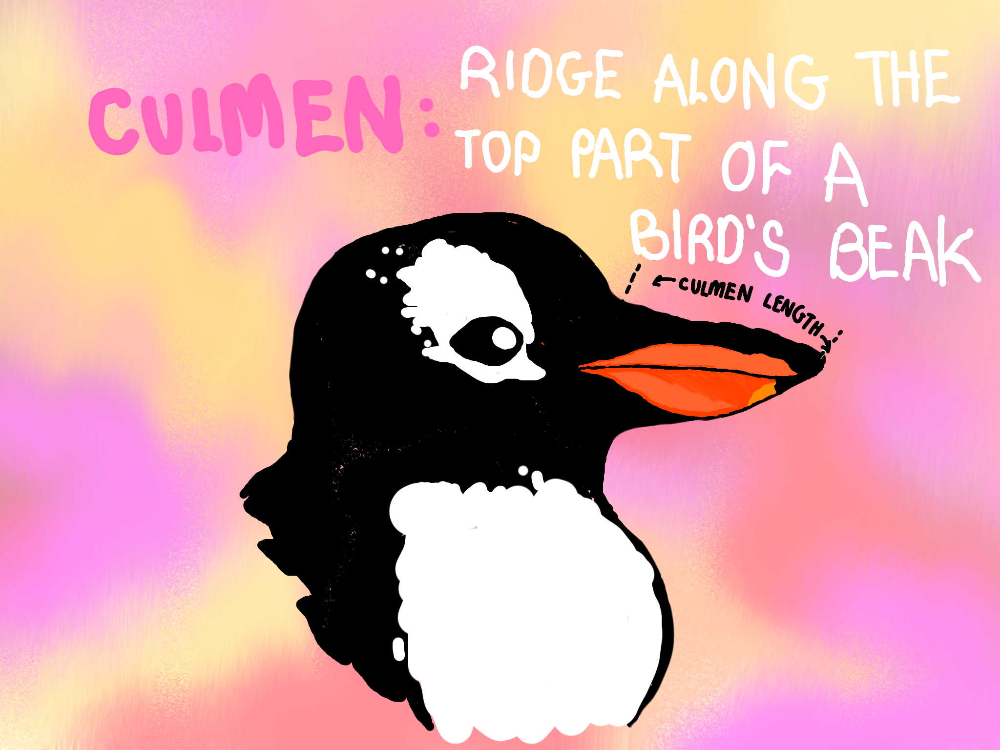

```{r install-package, include = FALSE, eval = FALSE}
# Copy and paste the following code into your console to download and install
# the `xaringan` package that contains all of the code which allows you 
# to create presentation slides in Rmarkdown
install.packages('xaringan')
install.packages("xaringanthemer")
```


```{r load-packages, include = FALSE}
# Add any additional packages you need to this chunk
library(tidyverse)
library(tidymodels)
library(palmerpenguins)
library(knitr)
library(xaringanthemer)
library(readxl)
```

```{r setup, include=FALSE}
# For better figure resolution
knitr::opts_chunk$set(fig.retina = 3, dpi = 300, fig.width = 6, fig.asp = 0.618, out.width = "80%")
```

```{r xaringan-tachyons, echo=FALSE}
xaringanExtra::use_tachyons()
```

```{r xaringanExtra, echo = FALSE}
xaringanExtra::use_progress_bar(color = "#548B54", location = "top")
```

```{r xaringan-themer, include=FALSE, warning=FALSE}
library(xaringanthemer)
style_mono_accent(
  base_color = "#4682B4",
  header_font_google = google_font("Josefin Sans"),
  text_font_google   = google_font("Montserrat", "300", "300"),
  code_font_google   = google_font("Fira Mono")
)

```


```{r load-data, include=FALSE}
# Load your data here
AVONET3_BirdTree <- read_excel("data/AVONET3_BirdTree.xlsx", 
    sheet = "AVONET3_BirdTree")
```


# Introduction

We chose to investigate the AVONET Bird dataset. This dataset includes many traits of various species of birds, such as physical characteristics, geographical location and other ecological variables.

The dataset contains 9,993 observations with 36 columns. However we will only be utilising 6 variables for our investigation.

We analysed this data in order to answer the following research question:

.bg-washed-green.b--dark-green.ba.bw2.br3.shadow-5.ph4.mt5[
What is the relationship between beak length, mass, and trophic level amongst different habitats?

.tr[

]]


---
# The variables being used:
.pull-left[
- Species, Total Individuals, Habitat, Trophic Level, Culmen Length and Mass

- We decided to separate the birds by habitat, because the food available will differ by each habitat, and consequently so will the eating habits (trophic level) of the birds. 
]
--
.pull-right[
- Culmen length of a bird:

```{r culmen, out.width = "100%", fig.width = 4, echo = FALSE}

```
]
---

# Total individuals within each habitat
.pull-left[
- This bar chart shows the number of total individuals recorded within each habitat.

- The visualisation shows that the overwhelming majority of individuals were recorded within the forest habitat.
]

--

.pull-right[
```{r, out.width= "100%", fig.width= 8, echo=FALSE}
Bird_data <- AVONET3_BirdTree %>%
  select(Species3, Total.individuals, Beak.Length_Culmen, Habitat, Trophic.Level, Trophic.Niche, Mass) %>%
  filter(Total.individuals > 5)
 

Total_Habitat <- Bird_data %>%
  group_by(Habitat) %>%
  summarise(total.birds = sum(Total.individuals)) %>%
  filter(Habitat != "NA")


ggplot(data  = Total_Habitat, 
       aes(x = Habitat,
           y = total.birds,
           fill = Habitat)) +
         geom_col() +
  theme_minimal() +
    theme(axis.text.x = element_text(angle = 45, hjust = 1, size = 10)) +
      scale_fill_brewer(type = "div",
                        palette = 9,
                        direction = 1,
                        aesthetics = "fill") +
  labs(title = "Total bird count within each habitat",
       x = "Habitat",
       y = "Total Birds")
```
]

---

```{r, echo=FALSE}
histogram <- ggplot(Bird_data, 
       aes(
         x = Beak.Length_Culmen, 
         weight = Total.individuals)) +
  geom_histogram(binwidth = 0.2, fill = "steelblue") +
  labs(title = "Histogram of Beak Lengths (Weighted by Individuals)",
       x = "Beak Length (Culmen)", 
       y = "Total Individuals") +
  scale_x_continuous(limits = c(0, 100)) +
  theme_minimal() +
  geom_vline(xintercept = c(8, 25), 
             linetype = "dashed", 
             color = "red") 

suppressWarnings(print(histogram))
```


---

# Scatterplot of mass and culmen length

.pull-left[
- This shows a positive correlation between the logarithm of the two variables

- The variables have a logarithmic relationship
]

--
.pull-right[
```{r,out.width= "100%", fig.width= 6, echo=FALSE}
birds.data_mass <- Bird_data %>%
  select(Species3, Total.individuals, Beak.Length_Culmen, Habitat, Mass, Trophic.Level)%>%
  mutate(Mass_kg = Mass/1000,
         log_mass_kg = log(Mass_kg), log_culmen = log(Beak.Length_Culmen)) %>%
  filter(Trophic.Level != "NA")

ggplot(data = birds.data_mass,
       mapping = aes(x = log_culmen,
                     y = log_mass_kg)) +
  geom_point(alpha = 0.6, size = 0.6, mapping = aes(colour = Trophic.Level)) +
  geom_smooth(method = lm, se = FALSE, formula = y ~ x) +
  labs(
    title = "Bird Culmen Length vs. Mass",
    subtitle = "by trophic level",
    x = "Log of Culmen Length (cm)", 
    y = "Log of Mass (kg)",
    colour = "Trophic Level"
  ) +
  scale_colour_manual(values = c(
    "Carnivore" = "#88419d",
    "Herbivore" = "#d7b5d8",
    "Omnivore" = "#41b6c4",
    "Scavenger" = "#0570b0"
  )) +
  theme_minimal() +
  theme(legend.title = element_text(size = 12))
```
]

---

# Layouts

You can use plain text

- or bullet points

.pull-left[
or text in two columns $^*$
]
.pull-right[
- like
- this
]

.footnote[
[*] And add footnotes
]

---

# Code

```{r boring-regression}
# a boring regression
model <- lm(dist ~ speed, data = cars)
tidy(model)
glance(model)
```

---

# Plots

```{r recode-species, echo = FALSE}
# In this chunk I'm doing a bunch of analysis that I don't want to present 
# in my slides. But I need the resulting data frame for a plot I want to present.
iris_modified <- iris %>%
  mutate(Species = fct_other(Species, keep = "setosa"))
```

```{r plot-iris, echo = FALSE}
# Code hidden with echo = FALSE
# Uses modified iris dataset from previous chunk
# Play around with height and width until you're happy with the look
ggplot(data = iris_modified, mapping = aes(x = Sepal.Width, y = Sepal.Length, color = Species)) +
  geom_point() + 
  theme_minimal() # theme options: https://ggplot2.tidyverse.org/reference/ggtheme.html
```

---

## Plot and text

.pull-left[
- Some text
- goes here
]
.pull-right[
```{r warning=FALSE, out.width="100%", fig.width=4, echo=FALSE}
# see how I changed out.width and fig.width from defaults
# to make the figure bigger
ggplot(penguins, aes(x = bill_length_mm, y = species, color = species)) +
  geom_boxplot() +
  theme_minimal()
```
]

---

# Tables

If you want to generate a table, make sure it is in the HTML format (instead of Markdown or other formats), e.g.,

```{r iris-table, echo = FALSE}
kable(head(iris), format = "html")
```

---

# Images

```{r castle, echo = FALSE, out.width = "55%", fig.align = "center", fig.cap = "Image credit: Photo by Jörg Angeli on Unsplash."}
include_graphics("img/edinburgh-castle.jpg")
```

Or you can also include a full page image. See next slide.

---


class: inverse, center, middle
background-image: url(img/edinburgh-castle.jpg)
background-size: contain
---

# Math Expressions

You can write LaTeX math expressions inside a pair of dollar signs, e.g. &#36;\alpha+\beta$ renders $\alpha+\beta$. You can use the display style with double dollar signs:

```
$$\bar{X}=\frac{1}{n}\sum_{i=1}^nX_i$$
```

$$\bar{X}=\frac{1}{n}\sum_{i=1}^nX_i$$

Limitations:

1. The source code of a LaTeX math expression must be in one line, unless it is inside a pair of double dollar signs, in which case the starting `$$` must appear in the very beginning of a line, followed immediately by a non-space character, and the ending `$$` must be at the end of a line, led by a non-space character;

1. There should not be spaces after the opening `$` or before the closing `$`.

1. Math does not work on the title slide (see [#61](https://github.com/yihui/xaringan/issues/61) for a workaround).

---

# Feeling adventurous?

- Want to find out more about `xaringan`? See https://slides.yihui.name/xaringan/#1.

- You are welcome to use the default styling of the slides. In fact, that's what I expect majority of you will do. You will differentiate yourself with the content of your presentation.

- But some of you might want to play around with slide styling. The 
`xaringanthemer` provides some solutions for this that: https://pkg.garrickadenbuie.com/xaringanthemer.

- And if you want more bells and whistles, there is also `xaringanExtra`: https://pkg.garrickadenbuie.com/xaringanExtra.
